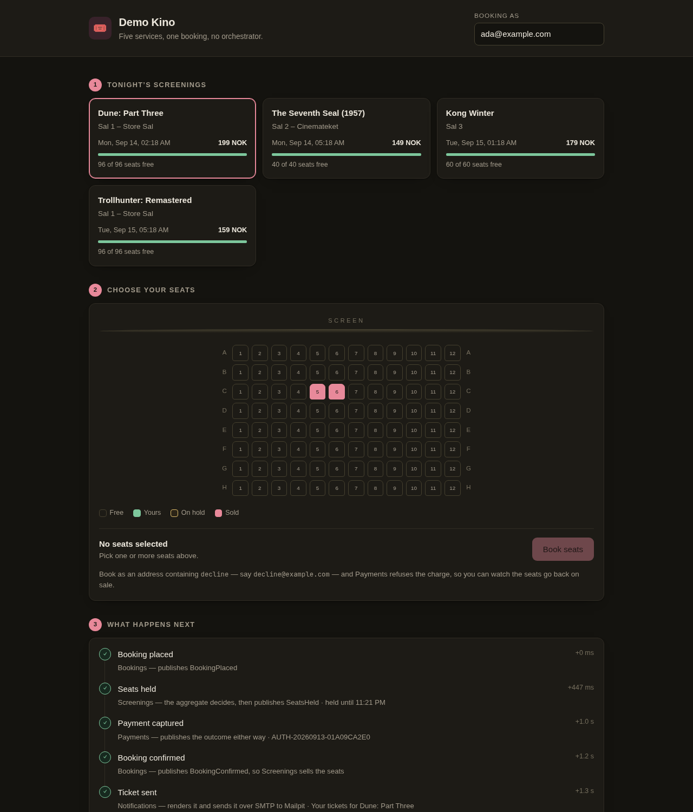

# Demo Kino

A cinema seat-booking system built as a .NET Aspire distributed application: **five
services**, a **message bus**, **PostgreSQL**, **Redis**, and a real **SMTP server** with
a web inbox so the demo ends in an e-mail you can actually open.

Each service is a bounded context with its own database, its own model and its own
vertical slices. They talk through published events on RabbitMQ, never through each
other's tables.

The UI does not just tell you that; it shows you. A live bus tape streams every message
as it is published and consumed, a "Short holds" switch compresses a three-minute seat
hold into twenty seconds so you can watch it expire, a chaos strip pauses or breaks
Payments on demand, "Race a rival" books the same seats twice at once to prove the
aggregate is the consistency boundary, and a trace waterfall reconstructs where the
milliseconds actually went. See [Watching it happen](#watching-it-happen).



> The screenshot above predates the bus tape, the chaos strip and "Race a rival" — it
> still shows the right idea, just not the current page. Worth re-capturing after a run.

```
                    ┌──────────── Gateway (YARP + Redis output cache) ────────────┐
                    │                          browser                            │
                    └───────────────┬───────────────────────────┬─────────────────┘
                           HTTP     │                           │   HTTP
                            ┌───────▼────────┐          ┌───────▼────────┐
                            │   Screenings   │◄──HTTP───│    Bookings    │
                            │  seat map,     │          │  the booking   │
                            │  holds, sales  │          │  process       │
                            └───────┬────────┘          └───┬────────┬───┘
                                    │                       │        │
        ═══════════════════════ RabbitMQ (MassTransit) ══════╪════════╪═══════════
                                    │                       │        │
                            ┌───────▼───────────────────────▼──┐  ┌──▼───────────┐
                            │             Payments             │  │Notifications │
                            │  captures or declines the charge │  │  SMTP → 📬   │
                            └──────────────────────────────────┘  └──────────────┘
```

## Running it

Requires the .NET 10 SDK, the `aspire` CLI, and a working container runtime.

```bash
aspire run
```

Open the dashboard it prints, then follow the **Demo Kino** link on the `gateway`
resource. The dashboard also links to pgweb, RedisInsight, the RabbitMQ management UI and
the Mailpit inbox.

Domain tests need no containers at all:

```bash
dotnet test
```

### Troubleshooting this machine

Two things unrelated to the code have to be sorted out before `aspire run` will work here:

1. **Docker is not running and your user is not in the `docker` group.**

   ```bash
   sudo systemctl enable --now docker
   sudo usermod -aG docker "$USER"   # then log out and back in
   ```

2. **The system-wide .NET SDK cannot build ASP.NET Core projects.**
   `/usr/share/dotnet/sdk/10.0.111` is missing the `Microsoft.AspNetCore.App` prune data,
   so *any* web project fails there with `NETSDK1226` — including a fresh `dotnet new web`.
   The mise SDK (`10.0.401`) builds everything fine, which is why `dotnet build` and
   `dotnet test` work, but `/usr/bin/aspire` resolves the system one. Either install the
   missing ASP.NET Core targeting pack for the system SDK, or install the CLI as a tool so
   it runs under the same SDK as the rest of the build:

   ```bash
   dotnet tool install -g aspire.cli
   ```

## The flow

Placing a booking is a single `POST /bookings` that returns `202 Accepted`. Everything
after that happens on the bus:

| # | Who | What | Message it publishes |
|---|-----|------|----------------------|
| 1 | Bookings | Creates the `Booking` aggregate in `Placed` | `BookingPlaced` |
| 2 | Screenings | `Screening.HoldSeats(…)` decides whether the seats can be had | `SeatsHeld` / `SeatHoldRejected` |
| 3 | Bookings | Moves to `AwaitingPayment` | `PaymentAuthorizationRequested` |
| 4 | Payments | `Payment.Capture(…)` or `Payment.Decline(…)` | `PaymentCaptured` / `PaymentDeclined` |
| 5 | Bookings | `Confirm(…)` or `Cancel(…)` | `BookingConfirmed` / `BookingCancelled` |
| 6 | Screenings | Turns the hold into a sale, or puts the seats back | — |
| 6 | Notifications | Sends the ticket or the apology over SMTP | — |

A few unhappy paths — and one race — are worth triggering on purpose:

* **Declined payment** — book with an address whose local part contains `decline`, e.g.
  `decline@example.com`. Payments refuses, Bookings cancels, Screenings releases the
  seats and Notifications mails an apology.
* **Expired hold** — a hold lives for three minutes by default. `SeatHoldSweeper` turns
  that deadline into a `SeatHoldExpired` event, which cancels the booking. It is the only
  thing in the system that is driven by the clock rather than by a message. Flip the
  masthead's **Short holds (20s)** switch first if you don't want to wait three minutes
  for it.
* **A broken card network** — the chaos strip under the seat map can pause, slow, or
  break Payments on purpose (see [Watching it happen](#watching-it-happen)).
* **Two customers, one seat** — **Race a rival** books the seats you picked twice at
  once, as you and as `rival@example.com`. Exactly one of you keeps them.

## Watching it happen

Five things exist purely so the choreography is visible instead of asserted:

* **The bus tape** (the rail beside the page) streams every integration event as it is
  published or consumed, over Server-Sent Events (`GET /api/events`). It is what the
  page actually reacts to — placing a booking no longer starts a fast poll; a tape entry
  for the booking you are watching schedules the one refresh that matters, and the poll
  loop underneath is only a slow safety net. On a narrow screen the rail becomes a dock
  pinned to the bottom: collapsed it costs one row, carrying the newest message, and it
  opens itself the first time the booking you just placed reaches the bus. Stacked at the
  end of a phone-length page instead, it would sit some four screens below the seat you
  booked, which is the same as not being there.
* **Short holds** (the masthead switch) shortens a new seat hold from three minutes to
  twenty seconds and speeds up `SeatHoldSweeper` to match (`GET`/`POST
  /screenings/hold-policy`), so the "seats went back on sale on their own" path is
  something you can watch rather than take on faith.
* **The chaos strip** (`GET`/`POST /payments/chaos`) can pause Payments — the next
  authorization sits on the queue exactly as a stalled card network would leave it,
  unacknowledged and un-retried — slow it down by about five seconds, or make it fail
  once or twice before succeeding, so MassTransit's retry policy is something you watch
  happen rather than a line in `MessagingExtensions.cs`.
* **Race a rival** places two bookings for the same seats in the same instant. Both pass
  Bookings' courtesy check; `Screening.HoldSeats` is where it is actually decided, and
  the loser's flow shows a rejected hold, not a rollback — there was nothing to roll
  back. When the two land closely enough to collide on PostgreSQL's `xmin`, the bus tape
  shows exactly that: a faulted row, then a retried success.
* **The trace waterfall**, under each flow, is reconstructed from the bus tape's own
  timestamps — one lane per service, and a hairline above the lanes for the gap between
  a message being published and it being picked up, the actual argument for asynchronous
  messaging made visible. It says plainly that it is reconstructed, not measured, because
  five processes' clocks agree to within a millisecond or two on one machine and nothing
  more; the link beside it opens the real thing in the Aspire dashboard.

## How it is put together

### Domain-driven design

* **Aggregates are the consistency boundary.** `Screening` owns every seat in its
  auditorium, so "two customers cannot hold the same seat" is enforced by one object in
  memory rather than by a database constraint or a handler. `Booking` and `Payment` are
  the other two roots.
* **Value objects instead of primitives.** `Money`, `SeatNumber` and `EmailAddress` are
  self-validating and immutable, and their factories return `Result<T>` rather than
  throwing. Identifiers are strongly typed (`ScreeningId`, `BookingId`, `PaymentId`), so
  passing the wrong one is a compile error.
* **Failures are values.** `Result` / `Error` carry expected business outcomes; exceptions
  are reserved for broken invariants (see `Guard`).
* **Domain events, then integration events.** An aggregate raises a domain event; a
  handler inside the same context translates it into the published language in
  `Demo.Aspire.Contracts`. The contracts assembly is primitives only, so contexts can
  change their models without breaking each other.
* **Context mapping.** Bookings refers to a screening as a `ScreeningReference` and keeps
  its own `ScreeningDetails`; Screenings refers to a booking as a `BookingReference`.
  `ScreeningCatalogClient` is an anti-corruption layer around the one HTTP call between
  contexts.
* **`Booking` is the process manager.** The legal transitions of the whole flow live in
  the aggregate, not in a workflow engine, and late messages are rejected there: a
  confirmed booking refuses a lapsed-hold cancellation.

### Vertical slice architecture

There is no `Controllers/`, `Services/` or `Repositories/` folder. Each feature is a
folder under `Features/` containing everything it needs — request, validator, handler,
HTTP endpoint or message consumer, and the domain-event handlers it owns:

```
Features/HoldSeats/HoldSeatsConsumer.cs      ← consumer + the publisher for its outcome
Features/GetSeatMap/GetSeatMap.cs            ← endpoint + handler + cache invalidation
Features/PlaceBooking/PlaceBooking.cs        ← request + validator + handler + endpoint
```

Endpoints implement `IEndpoint` and are discovered by assembly scan; slice handlers are
registered by convention. Adding a feature never means editing another one.

### Reliability

* **Transactional outbox and inbox** (MassTransit + EF Core). `EfUnitOfWork` dispatches
  domain events *before* `SaveChanges`, so the outbox row and the aggregate change commit
  together. A crash can never leave "seats held" without "everyone was told".
* **Optimistic concurrency** on PostgreSQL's `xmin`, so two simultaneous holds on the same
  screening cannot both win — **Race a rival** in the UI exists to make this observable
  on purpose rather than theoretical.
* **Idempotent aggregates.** `HoldSeats`, `SeatsWereHeld`, `Confirm` and `Cancel` all
  treat a repeat as a no-op, so redelivery is safe even before the inbox is consulted.
* **Notifications has no database**, so it uses Redis `SET NX` as its de-duplication
  ledger instead of an inbox.

### Where each piece of infrastructure earns its place

| Infrastructure | Used for |
|---|---|
| **PostgreSQL** | Three databases, one per context, plus the outbox/inbox tables |
| **RabbitMQ** (MassTransit) | Every message between contexts |
| **Redis** | Seat-map projection cache, the gateway's output cache, Notifications' de-duplication ledger and feed, and the bus tape every service writes to and the gateway streams from |
| **Mailpit** | A real SMTP server with a web inbox |
| **YARP** | The gateway that fronts all four services under `/api` |

### .NET 10 / C# 14

Extension members (`extension(IHostApplicationBuilder builder) { … }` in
`MessagingExtensions`, `PlatformExtensions`, `ResultExtensions`), the `field` keyword
(`CorrelationContext`), collection expressions and spread throughout, `Guid.CreateVersion7`
for sortable identifiers, `TimeProvider` everywhere instead of `DateTime.UtcNow`, EF Core
complex properties for value objects, and minimal APIs with `TypedResults`.

The five features in [Watching it happen](#watching-it-happen) add a few more:
`TypedResults.ServerSentEvents` for the bus tape (the SSE support minimal APIs gained in
.NET 10), `JsonStringEnumConverter<TEnum>` on the enums that cross the wire so a bare
`[JsonConverter]` attribute is enough for every serializer — source-generated or not —
to agree on the same string, `System.Threading.Lock` in `ChaosSwitch`, the
`CancellationTokenSource(TimeSpan, TimeProvider)` overload for its five-minute ceiling,
and `PeriodicTimer.Period`'s setter so `SeatHoldSweeper` can re-read the demo's hold
policy on every tick instead of only at start-up.

## Projects

| Project | What it is |
|---|---|
| `Demo.Aspire.AppHost` | The Aspire app host: every container and service, and how they are wired |
| `Demo.Aspire.SharedKernel` | Tactical DDD building blocks. No package references at all |
| `Demo.Aspire.Contracts` | The published language: integration events, primitives only |
| `Demo.Aspire.Platform` | Shared infrastructure: endpoint scanning, domain-event dispatch, outbox wiring |
| `Demo.Aspire.ServiceDefaults` | OpenTelemetry, health checks, service discovery, resilient HTTP |
| `Demo.Aspire.Screenings` | Screenings, seat maps, holds and sales |
| `Demo.Aspire.Bookings` | The booking aggregate and the process it drives |
| `Demo.Aspire.Payments` | Capturing and declining charges |
| `Demo.Aspire.Notifications` | Turning confirmed facts into e-mail |
| `Demo.Aspire.Gateway` | YARP reverse proxy, Redis output cache, and the demo UI |
| `Demo.Aspire.Domain.Tests` | Aggregate and value-object rules, plus offline EF model checks |

## Notes and shortcuts

* The schema is created with `EnsureCreatedAsync()` rather than migrations, which keeps
  the demo to one command. Because that does nothing once the database exists, PostgreSQL
  deliberately has **no data volume**: every `aspire run` starts from a freshly seeded
  database, and a model change can never leave you with a stale schema and a wall of
  500s. `DatabaseInitializer<TDbContext>` is where to switch to `MigrateAsync()`, and
  that is the point at which a volume becomes worth adding.
* `SimulatedPaymentGateway` stands in for a card network. It is deliberately predictable
  so both endings can be demonstrated on purpose.
* Health endpoints are exposed in development only, as in the Aspire templates.
